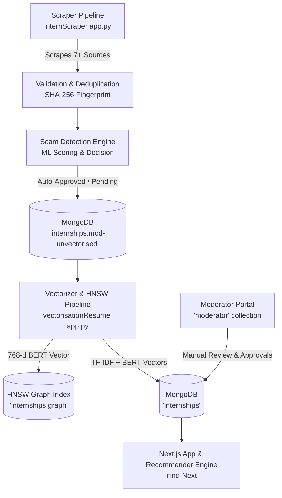

# iFind Platform — System Context, Architecture & Moderation Pipeline

> **Master Architecture & Integration Reference**  
> Comprehensive documentation covering the full end-to-end moderation pipeline, vectorization graph maintenance, API endpoints, database schemas, and Moderator Portal specifications.

---

## 1. System Architecture Overview

The iFind platform operates a 5-tier microservice & web architecture:



---

## 2. End-to-End Moderation & Vectorization Pipeline

### Phase 1: Scraping & Ingestion (`internScraper`)
- **Scraper Services**: Collects raw listings from 7+ platforms (GitHub, Internshala, Indeed, Naukri, Unstop, Freshersworld, Letsintern).
- **Normalizer**: Standardizes field names (`name`, `company`, `applyLink`, `summary`, `stipend`, `duration`, `skills`, `location`).

### Phase 2: Deduplication & Basic Validation
- **Required Fields**: Filters out listings missing `name`, `company`, `applyLink`, or `summary`, or having non-HTTP URLs.
- **SHA-256 Fingerprint**: Computes `hashlib.sha256(company:name:city)` for exact deduplication. Skips duplicate records instantly.

### Phase 3: Scam Detection & Moderation Classification (`scam_detector`)
- **ML Scoring**: Evaluates company risk, text risk, URL risk, stipend anomalies, and flags.
- **Decision Engine**:
  - `decision == "clear"` $\rightarrow$ `moderation.status = "auto_approved"`
  - `decision == "review"` $\rightarrow$ `moderation.status = "pending_review"`
  - `decision == "block"` $\rightarrow$ `moderation.status = "auto_rejected"`
- **Staging Output**: Inserts processed candidate documents into MongoDB collection **`internships.mod-unvectorised`**.

### Phase 4: Vectorization & HNSW Graph Indexing (`vectorisationResume`)
- **Unvectorised Retrieval**: Reads pending listings from `internships.mod-unvectorised`.
- **Vector Generation**:
  - **TF-IDF Vector**: 15,000-dimensional boosted TF-IDF embedding based on skill clusters.
  - **BERT Vector**: 768-dimensional dense embedding generated via `sentence-transformers/all-mpnet-base-v2`.
- **HNSW Graph Node Insertion**: Inserts 768-d BERT vector into local HNSW graph index (`internships_index.bin`) mapped to document `_id`.
- **Graph Persistence**: Serializes updated HNSW graph bytes and ID mappings into MongoDB collection **`internships.graph`**.
- **Final Storage & Cleanup**:
  1. Writes document containing `tfidf_vector` & `bert_vector` to main collection **`internships`**.
  2. Deletes record from **`internships.mod-unvectorised`**.

---

## 3. Moderation Schema Reference (`moderation` Sub-document)

The `moderation` field stored in MongoDB internship documents adheres to the following structure:

```json
{
  "moderation": {
    "status": "auto_approved",
    "score": 25.34,
    "flags": [
      "No significant risk signals detected; listing appears consistent with..."
    ],
    "source": "web_scraping",
    "reviewedBy": null,
    "reviewedAt": "2026-08-06T19:01:25.581148+00:00",
    "rejectionReason": null,
    "scamDetails": {
      "score": 25.34,
      "decision": "clear",
      "confidence": 0.5312,
      "explanationSummary": "No significant risk signals detected; listing appears consistent with...",
      "scamFlags": [
        "No significant risk signals detected; listing appears consistent with..."
      ],
      "evaluatedAt": "2026-08-06T19:01:25.581136+00:00",
      "riskBreakdown": null
    }
  }
}
```

### Moderation Status Types:
- `"auto_approved"`: Passed automated scam detector filters.
- `"pending_review"`: Flagged for manual moderator review.
- `"auto_rejected"`: Blocked by automated risk thresholds.
- `"manually_approved"`: Approved by an authorized moderator.
- `"manually_rejected"`: Rejected by an authorized moderator.

---

## 4. Moderator Portal Specification (`moderator` Collection)

The Moderator Portal manages human moderation, user verification, and platform oversight.

### Database Collection: `moderator`
```typescript
interface IModerator {
  _id: ObjectId;
  name: string;
  email: string;
  passwordHash: string;
  isVerified: boolean;         // false until verified by another verified moderator
  verifiedBy?: ObjectId | null; // ID of the moderator who verified this account
  verifiedAt?: Date | null;
  role: "moderator" | "super_moderator";
  createdAt: Date;
  updatedAt: Date;
}
```

### Core Moderator Capabilities:

1. **Authentication & Unverified Registration**
   - **Login**: Authenticate existing moderator credentials.
   - **Register**: New moderator accounts default to `isVerified: false`.
   - **Access Control**: Unverified moderators cannot perform approval/rejection actions until a verified moderator approves their account.

2. **Internship Queue Moderation & Manual Override**
   - View pending queue (`moderation.status == "pending_review"`), scam-suspected listings, link issues, and low-score items.
   - **Approve Action**:
     - Updates `moderation.status = "manually_approved"`
     - Sets `moderation.reviewedBy = <moderator_id>`
     - Sets `moderation.reviewedAt = <current_timestamp>`
   - **Reject Action**:
     - Updates `moderation.status = "manually_rejected"`
     - Sets `moderation.reviewedBy = <moderator_id>`
     - Sets `moderation.reviewedAt = <current_timestamp>`
     - Sets `moderation.rejectionReason = <rejection_reason>`

3. **Platform Entity Oversight & Visibility**
   - **Employers View (`employer` collection)**: View registered company profiles, posted listings, and employer status.
   - **Students / Job Seekers View (`users` collection)**: View user profiles, application histories, and resume status.
   - **Moderators Management View (`moderator` collection)**: View all moderator accounts; verified moderators can verify pending moderator registrations (`isVerified: true`, `verifiedBy: moderatorId`).

---

## 5. API Endpoints & Routes Reference

### Python Microservices (`FastAPI`)

#### 1. Ingestion Scraper API (`internScraper/app.py` — Port 7860)
| Method | Endpoint | Description |
| :--- | :--- | :--- |
| **`GET`** | `/health` | Liveness health check |
| **`POST`** | `/scrape` | Starts background scrape job for selected sources |
| **`GET`** | `/scrape/{job_id}` | Polls status, progress, and stats of a scrape job |
| **`GET`** | `/scrape` | Lists all recent scrape jobs |
| **`GET`** | `/docs` | Interactive Swagger UI documentation |

#### 2. Vectorizer & HNSW Service (`vectorisationResume/app.py` — Port 7860)
| Method | Endpoint | Description |
| :--- | :--- | :--- |
| **`GET`** | `/` | Service readiness and model status |
| **`GET`** | `/health` | Model loading state health check |
| **`POST`** | `/encode-internships` | Batch encodes internship descriptions into TF-IDF + BERT vectors |
| **`POST`** | `/encode-resume` | Encodes user resume (text/parsed JSON) into TF-IDF + BERT vectors |
| **`POST`** | `/vectorize-hnsw` | Triggers unvectorised internship HNSW graph pipeline |
| **`GET`** | `/docs` | Interactive Swagger UI documentation |

---

### Next.js Application (`ifind-Next` / `ifind` API Routes)

#### 1. Authentication & Session
| Method | Endpoint | Description |
| :--- | :--- | :--- |
| **`POST`** | `/api/auth/register` | User/Student registration |
| **`POST`** | `/api/auth/login` | User/Employer/Moderator login |
| **`POST`** | `/api/auth/logout` | Clears authentication session cookie |
| **`GET`** | `/api/auth/session` | Retrieves active user session |

#### 2. Moderator & Admin Management
| Method | Endpoint | Description |
| :--- | :--- | :--- |
| **`GET`** | `/api/admin/moderation` | Paginated queue of pending/flagged internships + metrics |
| **`PATCH`** | `/api/admin/moderation` | Bulk approve or reject internship IDs |
| **`GET`** | `/api/admin/moderation/[id]` | Fetch single internship document for review |
| **`PATCH`** | `/api/admin/moderation/[id]` | Approve or reject a single internship listing |
| **`POST`** | `/api/admin/vectorize` | Trigger HF vectorization for specified internship IDs |
| **`POST`** | `/api/admin/moderators/verify` | Verify a pending moderator account (`isVerified: true`) |

#### 3. User & Resume Operations
| Method | Endpoint | Description |
| :--- | :--- | :--- |
| **`GET`** | `/api/user/profile` | Get user profile data |
| **`POST`** | `/api/user/resume/commit` | Upload & save confirmed resume data |
| **`POST`** | `/api/user/resume/vectorize` | Encode resume & generate top-N personalized recommendations |
| **`GET`** | `/api/user/dashboard` | Fetch dashboard stats and recommended internships |

#### 4. Internships & Public Listings
| Method | Endpoint | Description |
| :--- | :--- | :--- |
| **`GET`** | `/api/internships` | List active, approved internships (search, filter, pagination) |
| **`GET`** | `/api/internships/[id]` | Fetch detailed internship listing |
| **`POST`** | `/api/internships/[id]/apply` | Submit student application for an internship |